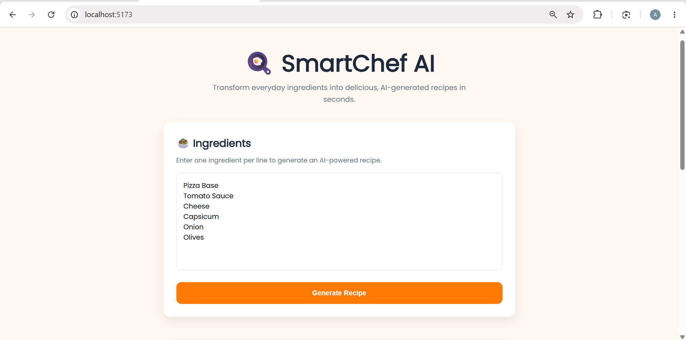
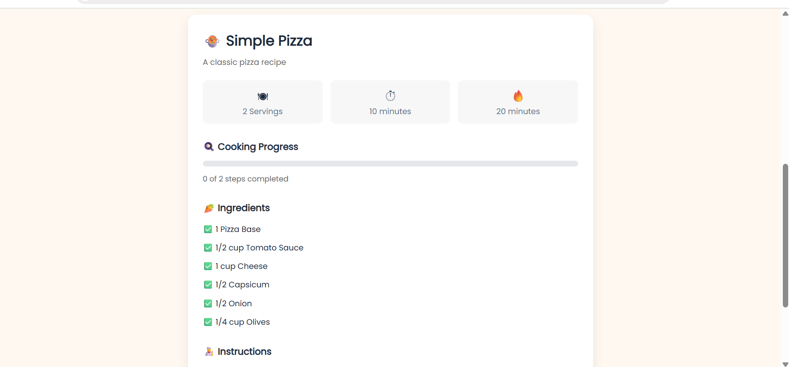

# SmartChef AI

SmartChef AI is an AI-powered recipe generation web application that transforms a list of available ingredients into a structured, interactive recipe. Built using React, Node.js, Express.js, and the Groq Llama 3.3 70B Versatile language model, the application converts unpredictable AI responses into a reliable and user-friendly experience.

This project was developed as part of a Frontend Internship Assignment with a focus on structured AI output, robust error handling, and interactive user interfaces.

---

## Live Demo

**Frontend:**  
https://smartchef-ai-frontend.onrender.com

---

## Demo Video

https://drive.google.com/file/d/1v2dmWdFuwB2Liwl6RPnq3LLJPAD-hvq2/view?usp=sharing

---

## Overview

SmartChef AI enables users to generate personalized recipes using ingredients they already have. Instead of displaying raw AI-generated text, the application requests structured JSON from a Large Language Model and renders the response as interactive React components.

The application emphasizes reliability by validating AI responses, handling malformed outputs gracefully, preventing stale responses from overwriting newer requests, and providing loading, retry, and error states.

---

## Features

- AI-powered recipe generation
- Free-form ingredient input
- Structured JSON parsing and validation
- Recipe title, description, preparation time, cooking time, and serving size
- Ingredient quantities
- Interactive cooking checklist
- Cooking progress tracker
- Ingredient substitution suggestions
- Loading, error, and empty states
- Retry mechanism for failed requests
- Protection against stale API responses
- Responsive design for desktop and mobile devices

---

## Tech Stack

### Frontend

- React.js
- Vite
- Axios
- React Hot Toast
- CSS3

### Backend

- Node.js
- Express.js

### AI Integration

- Groq API
- Llama 3.3 70B Versatile

---

## Project Structure

```text
smartchef-ai/
│
├── client/
│   ├── src/
│   │   ├── assets/
│   │   ├── components/
│   │   ├── services/
│   │   ├── styles/
│   │   ├── App.jsx
│   │   └── main.jsx
│
├── server/
│   ├── config/
│   ├── controllers/
│   ├── prompts/
│   ├── routes/
│   ├── services/
│   └── server.js
│
├── screenshots/
│
└── README.md
```

---

## Getting Started

### Clone the Repository

```bash
git clone https://github.com/Amulya-94/smartchef-ai.git
cd smartchef-ai
```

### Install Dependencies

#### Backend

```bash
cd server
npm install
```

#### Frontend

```bash
cd ../client
npm install
```

---

## Environment Variables

Create a `.env` file inside the `server` directory.

```env
GROQ_API_KEY=your_groq_api_key
PORT=5000
```

---

## Running the Application

### Start the Backend

```bash
cd server
npm run dev
```

### Start the Frontend

```bash
cd client
npm run dev
```

Open the application in your browser:

```
http://localhost:5173
```

---

## AI Integration

SmartChef AI uses the Groq API with the Llama 3.3 70B Versatile language model to generate structured recipe data.

The AI returns structured JSON containing:

- Recipe title
- Recipe description
- Preparation time
- Cooking time
- Serving size
- Ingredient quantities
- Step-by-step cooking instructions
- Ingredient substitution suggestions

The backend validates and parses the generated JSON before sending it to the frontend, ensuring reliable rendering even when the model returns malformed or unexpected responses.

---

## Error Handling and Reliability

The application is designed to gracefully handle unreliable AI responses.

Implemented safeguards include:

- Validation of AI-generated JSON
- Detection of malformed or invalid responses
- Handling of empty responses
- Network and API error handling
- Retry functionality
- Loading indicators
- User-friendly error messages
- Protection against stale API responses

---

## Example

### Input

```text
Chicken
Rice
Onion
Tomato
Garlic
```

### Output

The generated recipe includes:

- Recipe title
- Description
- Preparation time
- Cooking time
- Serving size
- Ingredient quantities
- Interactive cooking checklist
- Cooking progress tracker
- Ingredient substitution suggestions

---

## Screenshots

### Home Page



### Generated Recipe



### Progress Tracker


---

## AI Development Assistance

AI-assisted development tools were used to:

- Brainstorm the application architecture
- Refine prompts for structured JSON generation
- Debug React and Express implementation issues
- Improve error handling strategies
- Review and refine project documentation

All implementation, integration, testing, debugging, and final development decisions were completed and verified manually.

---

## Known Limitations

- Requires an active internet connection
- Recipe quality depends on the AI model's responses
- Generates one recipe per request
- Nutritional information is not currently provided
- AI responses may occasionally suggest common pantry ingredients when appropriate

---

## Future Enhancements

- Nutritional information
- Recipe image generation
- Save favourite recipes
- Shopping list generation
- Cuisine-based filtering
- Dietary preference support
- Recipe history
- Dark mode

---

## Time Spent

Approximate development time: **8 hours**

| Task | Time |
|------|------:|
| Project Setup | 45 minutes |
| Frontend Development | 2.5 hours |
| Backend and AI Integration | 2 hours |
| Error Handling and Validation | 1 hour |
| UI Improvements | 45 minutes |
| Testing | 30 minutes |
| Documentation | 30 minutes |

---

## License

This project was developed for educational purposes as part of a Frontend Internship Assignment.

---

## Author

**Amulya Jonnalagadda**

B.Tech – Computer Science and Engineering  
SRM University-AP

GitHub: https://github.com/Amulya-94