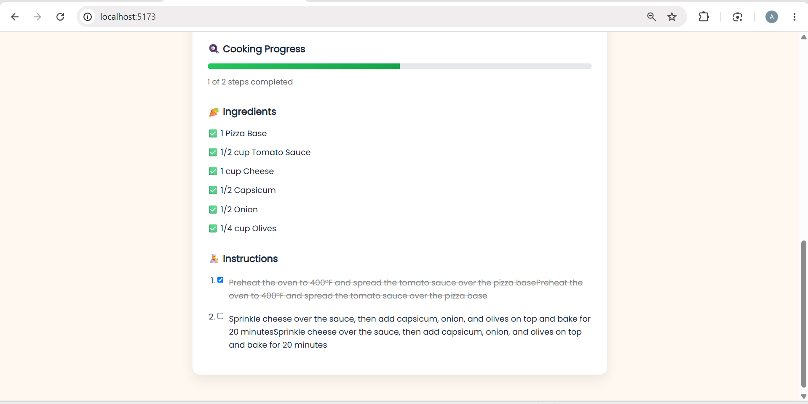

# 🍳 SmartChef AI

An AI-powered recipe generation web application that creates personalized recipes from the ingredients available in your kitchen. Built with React, Node.js, Express, and the Groq LLM API, SmartChef AI delivers structured recipes with ingredient quantities, cooking instructions, preparation time, and serving information.

---

## 📖 Overview

SmartChef AI helps users reduce food waste by suggesting recipes based on the ingredients they already have. Users simply enter a list of available ingredients, and the application generates a complete recipe using an AI language model.

---

## ✨ Features

- AI-powered recipe generation
- Structured recipe output
- Ingredient quantities
- Step-by-step cooking instructions
- Preparation & cooking time estimation
- Serving information
- Ingredient substitution suggestions
- Progress tracker with interactive checklist
- Retry mechanism for failed requests
- Robust JSON validation and error handling
- Responsive user interface

---

## 🛠 Tech Stack

### Frontend

- React.js
- Vite
- Axios
- React Hot Toast
- CSS3

### Backend

- Node.js
- Express.js
- Groq API (Llama 3.3 70B Versatile)

---

## 🏗 Architecture

```
SmartChef-AI
│
├── client
│   ├── assets
│   ├── components
│   ├── services
│   ├── styles
│   ├── App.jsx
│   └── main.jsx
│
├── server
│   ├── config
│   ├── controllers
│   ├── prompts
│   ├── routes
│   ├── services
│   └── server.js
│
└── README.md
```

---

## 🚀 Getting Started

### Clone the Repository

```bash
git clone https://github.com/<your-username>/SmartChef-AI.git
cd SmartChef-AI
```

### Install Dependencies

Frontend

```bash
cd client
npm install
```

Backend

```bash
cd ../server
npm install
```

---

## 🔑 Environment Variables

Create a `.env` file inside the `server` directory.

```env
GROQ_API_KEY=your_groq_api_key
PORT=5000
```

---

## ▶ Running the Application

Start the backend server

```bash
cd server
npm run dev
```

Start the frontend

```bash
cd client
npm run dev
```

Open:

```
http://localhost:5173
```

---

## 📌 Example Input

```
Chicken
Rice
Onion
Tomato
Garlic
```

---

## 📌 Example Output

The generated recipe includes:

- Recipe title
- Description
- Preparation time
- Cooking time
- Serving size
- Ingredient quantities
- Step-by-step instructions
- Ingredient swap suggestions

---

## 🛡 Error Handling

The application includes comprehensive error handling for:

- Invalid AI responses
- Malformed JSON
- Empty responses
- Network failures
- API rate limits
- Stale API requests
- Loading and retry states

---

## 📸 Screenshots

|
---



## 🔮 Future Enhancements

- Nutrition information
- Recipe image generation
- Favourite recipes
- Shopping list generation
- Cuisine-based filtering
- Dietary preference support
- Recipe history

---

## 📄 License

This project is intended for educational and internship evaluation purposes.

---

## 👤 Author

**Amulya Jonnalagadda**

B.Tech Computer Science and Engineering

SRM University-AP